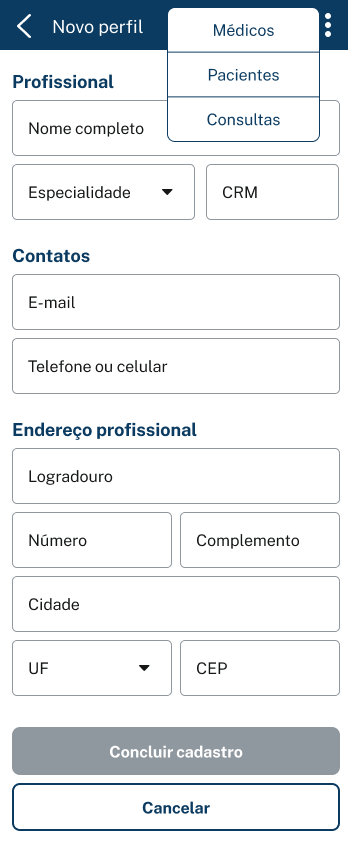

# vollmed

Projeto Alura - Spring boot 3

figma
https://www.figma.com/file/N4CgpJqsg7gjbKuDmra3EV/Voll.med?type=design&node-id=2-1007&t=9cO9sSLldEWOpjDq-0

Trello
https://trello.com/b/O0lGCsKb/api-voll-med

Post - Cadastrar Medicos
{
"nome": "Rodrigo Ferreira",
"email": "rodrigo.ferreira@voll.med",
"crm": "123456",
"especialidade": "ortopedia",
"endereco": {
"logradouro": "rua 1",
"bairro": "bairro",
"cep": "12345678",
"cidade": "Brasilia",
"uf": "DF",
"numero": "1",
"complemento": "complemento"
}
}
